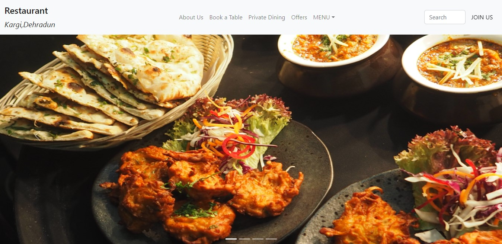
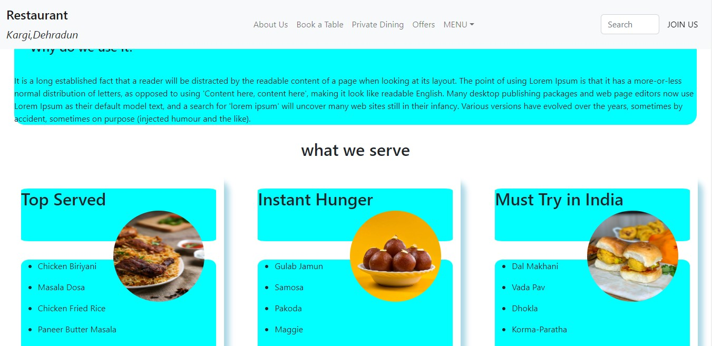
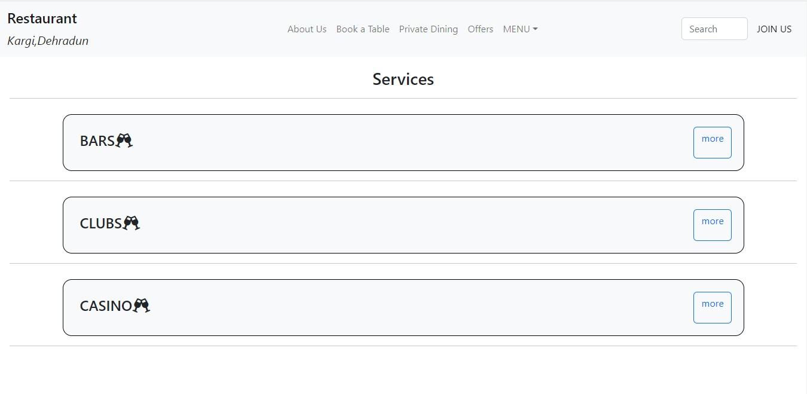
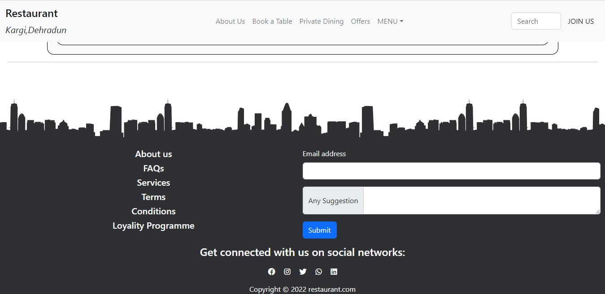

## Project's Title: Restaurant website........

**Project's Description:** The website is currently half developed (only front end) using react.
The main motive is to apply knowledge of react in a real world Problem.

**Screenshots**

**Technologies Used:**
- HTML
- CSS
- JavaScript
- React

**Following are the requirements to run this project:**

Node Package Manager (NPM),
React

